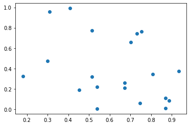
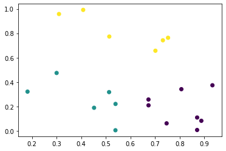

```python
import numpy as np
import matplotlib.pyplot as plt
from scipy.spatial.distance import cdist
```


```python
np.random.seed(14) # random değerler oluşturabilmemiz için kodlarımızın en üstüne bu tanımı yapmamız gerekir ve her seferinde aynı random değerleri almamızı sağlar.
n = 20 #rastgele (random) veri noktaları oluşturmak istiyoruz bu yüzden bir n değişkeni atıyoruz. n= nokta sayısı
p = 2 # p özellik sayısını temsil ediyor ör: bir kişinin yaşı ve boyu olabilir. (features) 
k = 3 # bir k değeri seçiyoruz (küme sayısı)
X = np.random.random((n,p)) # iki tane random veri noktaları kümesi tanımlamış olduk.
```


```python
plt.scatter(X[:,0], X[:,1]) #veri kümemizi plt.scatter ile x-y koordinatları üzerinde görselleştirebildik.
```


    <matplotlib.collections.PathCollection at 0x234042edf30>


    

    


```python
centers = X[np.random.choice(n, k, replace=False)] # n= nokta sayısı k=küme sayısı replace=false => aynı noktayı iki kez seçmememiz için 
# X' e atıyoruz çünkü biz bu 3 noktanın koordinatlarını random bir şekilde almak istiyoruz. 
# ve onu centers adında bir değişkene atıyoruz. Böylelikle başlangıç merkezlerimizi oluşturmuş olduk .
```


```python
((X[0]-centers[0])**2).sum()**0.5 #tek merkez ve tek nokta için öklid formülünü kullanarak noktalar arası uzaklığı hesapladık.
```


    0.7676966627027265


```python
((X-centers[0])**2).sum(axis=1) # axis=1 yapıyoruz çünkü her bir satır için veya n girdimiz için olan değerleri toplar. (sütunlar boyunca)
# eğer axis=0 yapsaydık satırlar boyunca toplamış olacaktır yani tek değer için.
#aynı zamanda 1D nesnelerimizi 2D nesneye genişletmiş olduk
```


    array([0.58935817, 0.10992272, 0.95830097, 0.09826461, 0.04638914,
           0.18475782, 0.        , 0.05970414, 0.29067225, 0.6190457 ,
           0.12083103, 0.27701494, 0.08133111, 0.45029453, 0.22733973,
           0.12755829, 0.04631859, 0.57972669, 0.98838235, 0.04138358])


```python
((X.reshape(n,1,p)-centers.reshape(1,k,p))**2).sum(axis=2)**0.5 # reshape şekillendirme komutunu kullanarak 2D olan nesnelerimizi 3D yaptık.
#aşağıda görmüş olduğumuz 3D arrayimiz her zaman için güzel bir örnek olmayabilir, belleğe fazla gelebilir ve aşabilir bu yüzden 
# bir önceki adımda gösterdiğim ((X-centers[0])**2).sum(axis=1) formül daha kullanışlı bu yüzden bunun üzerinden anlatacağım.
```


    array([[0.76769666, 0.78448615, 0.36700273],
           [0.33154596, 0.07722155, 0.73704815],
           [0.97892848, 1.04793878, 0.4827943 ],
           [0.31347187, 0.44202429, 0.26440458],
           [0.21538138, 0.37464254, 0.34858479],
           [0.42983464, 0.27129713, 0.52347543],
           [0.        , 0.35715303, 0.52632209],
           [0.2443443 , 0.24901305, 0.45753289],
           [0.53914029, 0.29435872, 0.64042595],
           [0.78679457, 0.6930882 , 0.53635628],
           [0.34760758, 0.03172537, 0.67708181],
           [0.52632209, 0.70598071, 0.        ],
           [0.2851861 , 0.27643117, 0.43155334],
           [0.67103989, 0.60317091, 0.44046217],
           [0.47680156, 0.74481974, 0.1931445 ],
           [0.35715303, 0.        , 0.70598071],
           [0.21521753, 0.14252875, 0.60789768],
           [0.76139786, 0.67738348, 0.50765081],
           [0.9941742 , 1.02691887, 0.52761227],
           [0.20342955, 0.44824302, 0.32304535]])


```python
distances = np.zeros((n,k)) # döngüye sokabilmemiz için önce bilgilerimizi tutacak boş bir veri kümesine atıyoruz ve boyutunu ayarlıyoruz.
for i in range(k):
    distances[:,i] = ((X-centers[i])**2).sum(axis=1)**0.5 # tüm n değer noktaları için aynı anda belirli bir küme için değerleri güncelleyeceğiz.
distances # yukarıdaki çıktıyla aynı sonucu aldığımızı görebiliriz yukarıdakinde bellek sorunu varken bu kullanımda daha kullanışlıdır.
```


    array([[0.76769666, 0.78448615, 0.36700273],
           [0.33154596, 0.07722155, 0.73704815],
           [0.97892848, 1.04793878, 0.4827943 ],
           [0.31347187, 0.44202429, 0.26440458],
           [0.21538138, 0.37464254, 0.34858479],
           [0.42983464, 0.27129713, 0.52347543],
           [0.        , 0.35715303, 0.52632209],
           [0.2443443 , 0.24901305, 0.45753289],
           [0.53914029, 0.29435872, 0.64042595],
           [0.78679457, 0.6930882 , 0.53635628],
           [0.34760758, 0.03172537, 0.67708181],
           [0.52632209, 0.70598071, 0.        ],
           [0.2851861 , 0.27643117, 0.43155334],
           [0.67103989, 0.60317091, 0.44046217],
           [0.47680156, 0.74481974, 0.1931445 ],
           [0.35715303, 0.        , 0.70598071],
           [0.21521753, 0.14252875, 0.60789768],
           [0.76139786, 0.67738348, 0.50765081],
           [0.9941742 , 1.02691887, 0.52761227],
           [0.20342955, 0.44824302, 0.32304535]])


```python
distances = cdist(X, centers) # cdist işlevi tarafından tanımlanan mesafelere sahibiz.
#Amacımız veri kümemizdeki her bir nokta için en yakın merkezin ne olduğunu bulmak ve en yakın noktanın hangi olaya yakın olduğu
#bu yüzden de hesaplayabilmemiz için mesafelere ihtiyacımız var.
closest = np.argmin(distances, axis=1) #mesafesi min olan nokta için argmin komutunu kullanarak min çeviriyoruz.
#bir dizi nokta için en küçüğünün indeksinin ne olduğunu(distances) bulmamız ve her biri (axis=1) adına bunu yapabilmemiz için
#ve bu kod parçası ile hangi noktanın en yakın olduğunu öğrenebileceğiz.
```


```python
X[closest == 0].mean(axis=0) #kümemizin ortalaması için yeni tahminin ne olduğunu anlamak istiyoruz bu yüzden merkez tahmin kümesine ait tüm noktaları almamız gerekiyor.
#en yakın (closet) kümesine ait noktaların değerlerini getirir.
#bu noktaların ortalamalarını sağlamamız için bir eksene ihtiyacımız var.
#axis=0 => sistemi daraltıyoruz ve tanımladığımız eksen, hesaplamayı yaptığımızda kaldırılacak eksen oluyor.
```


    array([0.55084464, 0.15675788])


```python
for i in range(k): # k aralığındaki i için tüm kümeler 
    centers[i, :] = X[closest == i].mean(axis=0) #tüm özellikler ve o küme için merkezlerini bu ortalama değerine atıyoruz.
centers # yeni merkez değerlerimizi çağırmış oluyoruz.
```


    array([[0.55084464, 0.15675788],
           [0.82671491, 0.17684988],
           [0.49020699, 0.66667282]])


```python
np.random.seed(4160659)
centers = X[np.random.choice(n, k, replace=False)]
closest = np.zeros(n).astype(int) 

while True: #while döngüsüne soktuk.
    old_closest = closest.copy() #bir önceki yakın kümesi (old_closet) kullanabilmemiz için tanımladık.
    print(closest) #closet kümesini yazdırmak için
    distances = cdist(X, centers)
    closest = np.argmin(distances, axis=1)
    
    for i in range(k):
        centers[i, :] = X[closest == i].mean(axis=0)
        
    if all(closest == old_closest): #bir noktadan sonra aynı değerleri vermemesi ve anlamlı olabilmesi için eski kümeyle yeni kümeyi karşılaştırdık.
        break #döngüden çıkması için
```

    [0 0 0 0 0 0 0 0 0 0 0 0 0 0 0 0 0 0 0 0]
    [2 0 2 1 1 1 0 1 1 2 1 2 1 2 2 1 0 2 2 1]
    [2 0 2 1 1 1 0 1 1 2 0 2 1 2 2 0 0 2 2 1]
    [2 0 2 1 1 1 0 1 1 2 0 2 1 2 1 0 0 2 2 1]
    [2 0 2 1 1 1 0 1 1 2 0 1 1 2 1 0 0 2 2 1]
    [2 0 2 1 1 1 0 1 0 2 0 1 1 2 1 0 0 2 2 1]
    [2 0 2 1 1 0 1 0 0 2 0 1 1 2 1 0 0 2 2 1]
    [2 0 2 1 1 0 1 0 0 2 0 1 0 2 1 0 0 2 2 1]
    


```python
plt.scatter(X[:,0],X[:,1],c=closest) #görselleştirmek için
```


    <matplotlib.collections.PathCollection at 0x23406424160>


    

    


```python
def kmeans(X, k): # kmeans fonk oluşturduk ve iki girdi alacak, biri üzerinde çalışacağı veri kümesi
                  # ikincisi ise sayısı olacak şekildedir.
    # başlangıç merkezleri
    n = X.shape[0] #gerçek hayatta kalan tek değer n yani nokta sayısı olur bu yüzden de verilerin şeklini tahmin etmek ve 
                   #bu tanımlama grubundaki ilk elemanı getirmek için X.shape[0] ifadesi kullanırız ve ona atarız. 
    centers = X[np.random.choice(n, k, replace=False)]    
    closest = np.zeros(n).astype(int)
    
    while True:
        old_closest = closest.copy()
        
        #kümelerin verilerini güncelledik
        distances = cdist(X, centers)
        closest = np.argmin(distances, axis=1)
        
        #centers güncelledik
        for i in range(k):
            centers[i, :] = X[closest == i].mean(axis=0)
            
        if all(closest == old_closest):
            break
            
    return closest, centers #işlem yapıldığında ekrana her defasında bir sürü bilgi yazdırmak yerine nihai bir sonuç
 #döndürmesini istiyoruz bu yüzden return kullanıp en yakınları ve merkezleri döndürüceğiz.
```


```python
labels, centers = kmeans(X, 4) #etiketlerin merkezlerini kmeans fonksiyonumuza atıyoruz.
print(labels)
print(centers)
```

    [0 1 0 2 2 1 3 1 1 0 1 2 1 0 2 1 1 0 0 2]
    [[0.56944108 0.8141337 ]
     [0.80751961 0.18099668]
     [0.39731074 0.30527733]
     [0.53888885 0.00587379]]
    


```python

```
